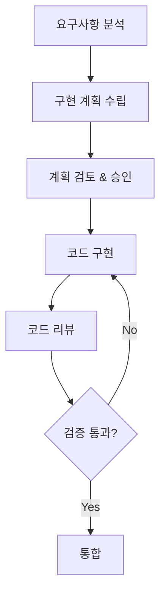

# 🚀 2026 AI 코딩 품질 최적화 가이드라인

> **버전**: 2.0.0 | **최종 업데이트**: 2026-01-20  
> **적용 대상**: React/JavaScript/TypeScript 기반 단일 파일 웹 애플리케이션  
> **참조 표준**: NIST AI RMF, ISO/IEC 42001, EU AI Act, Anthropic CLAUDE.md

---

## 📋 목차

1. [아키텍처 원칙](#1-아키텍처-원칙)
2. [클린 코드 원칙](#2-클린-코드-원칙)
3. [AI 협업 가이드라인](#3-ai-협업-가이드라인)
4. [React/JavaScript 스타일 가이드](#4-reactjavascript-스타일-가이드)
5. [보안 및 규정 준수](#5-보안-및-규정-준수)
6. [테스트 및 품질 보증](#6-테스트-및-품질-보증)
7. [문서화 표준](#7-문서화-표준)
8. [성능 최적화](#8-성능-최적화)

---

## 1. 아키텍처 원칙

### 1.1 클린 레이어 아키텍처 (Clean Layer Architecture)

단일 파일 애플리케이션에서도 **4계층 분리**를 준수합니다:

```
┌─────────────────────────────────────────────────────────────┐
│ LAYER 4: FRAMEWORKS & UI (프레젠테이션)                      │
│ - React 컴포넌트, Custom Hooks, Context                     │
│ - 사용자 인터랙션 처리                                        │
├─────────────────────────────────────────────────────────────┤
│ LAYER 3: INTERFACE ADAPTERS (인터페이스 어댑터)              │
│ - Repository 패턴 (StorageRepository)                       │
│ - 외부 시스템 어댑터 (ExcelAdapter, HTMLExportAdapter)       │
├─────────────────────────────────────────────────────────────┤
│ LAYER 2: USE CASES (유스케이스)                              │
│ - 비즈니스 로직 함수                                         │
│ - 통계 계산, CRUD 오퍼레이션                                 │
├─────────────────────────────────────────────────────────────┤
│ LAYER 1: DOMAIN (도메인)                                     │
│ - 엔티티, 값 객체, 상수                                      │
│ - 팩토리 함수                                                │
└─────────────────────────────────────────────────────────────┘
```

### 1.2 의존성 규칙 (Dependency Rule)

```javascript
// ✅ 올바름: 상위 레이어가 하위 레이어에 의존
const App = () => {
    const data = StorageRepository.load();           // Layer 4 → Layer 3
    const stats = calculateStatistics(data);         // Layer 3 → Layer 2
    const formatted = Formatters.currency(stats.total); // Pure function
};

// ❌ 잘못됨: 하위 레이어가 상위 레이어에 의존
const calculateStatistics = () => {
    ReactDOM.render(...);  // Domain/UseCase가 UI에 의존하면 안됨
};
```

### 1.3 단일 책임 원칙 (SRP)

각 모듈/함수는 **하나의 책임**만 가집니다:

| 책임 | 담당 모듈 | 예시 |
|------|----------|------|
| 데이터 스키마 | Domain Constants | `DOMAIN_CONSTANTS`, `createNewItem()` |
| 비즈니스 로직 | Use Cases | `calculateStatistics()`, `ItemUseCases` |
| 외부 I/O | Adapters | `StorageRepository`, `ExcelAdapter` |
| UI 렌더링 | Components | `StatCard`, `PlanTable`, `AppHeader` |

---

## 2. 클린 코드 원칙

### 2.1 SOLID 원칙

| 원칙 | 설명 | 적용 예시 |
|------|------|----------|
| **S**ingle Responsibility | 한 클래스/함수는 하나의 이유로만 변경 | `calculateStatistics()`는 통계만 계산 |
| **O**pen/Closed | 확장에 열려있고, 수정에 닫혀있음 | 새 Adapter 추가로 기능 확장 |
| **L**iskov Substitution | 부모 타입 자리에 자식 타입 대체 가능 | Repository 인터페이스 |
| **I**nterface Segregation | 클라이언트에 필요한 인터페이스만 노출 | 필요한 handler만 props로 전달 |
| **D**ependency Inversion | 고수준 모듈이 저수준 모듈에 의존하지 않음 | UseCase가 Repository 인터페이스에 의존 |

### 2.2 DRY/KISS/YAGNI

```javascript
// ✅ DRY: 반복 로직 추출
const sumCost = (arr) => arr.reduce((acc, item) => acc + (Number(item.cost) || 0), 0);
const confirmedOnly = (arr) => arr.filter(i => i.confirmed);

// 재사용
const totalCost = sumCost(items);
const confirmedCost = sumCost(confirmedOnly(items));

// ✅ KISS: 단순하게 유지
const isInvestment = (item) => 
    item.category?.replace(/\s/g, '').includes('투자');

// ✅ YAGNI: 필요할 때만 구현
// 미래에 필요할 "것 같은" 기능은 구현하지 않음
```

### 2.3 네이밍 컨벤션

| 대상 | 규칙 | 예시 |
|------|------|------|
| React 컴포넌트 | PascalCase | `StatCard`, `PlanTable` |
| 함수/변수 | camelCase | `calculateStatistics`, `handleChange` |
| 상수 | SCREAMING_SNAKE_CASE | `DOMAIN_CONSTANTS`, `STORAGE_KEY` |
| 커스텀 훅 | use 접두사 | `usePlanData`, `useFileHandlers` |
| 불리언 변수 | is/has/can 접두사 | `isConfirmed`, `hasError` |
| 이벤트 핸들러 | handle/on 접두사 | `handleClick`, `onSubmit` |

### 2.4 함수 설계 원칙

```javascript
// ✅ 좋은 함수: 작고, 한 가지 일만, 명확한 이름
const toggleConfirm = (items, id) =>
    items.map(item => item.id === id 
        ? { ...item, confirmed: !item.confirmed } 
        : item
    );

// ❌ 나쁜 함수: 여러 일을 하고, 길고, 부작용 있음
const doEverything = (items, id) => {
    // 확정 토글
    // 통계 계산
    // 로컬스토리지 저장
    // 알림 표시
    // ... 200줄 이상
};
```

---

## 3. AI 협업 가이드라인

### 3.1 프롬프트 엔지니어링 원칙

```markdown
## 효과적인 AI 프롬프트 작성법

1. **명확한 컨텍스트 제공**
   - 현재 기술 스택 명시
   - 기존 코드 구조 설명
   - 원하는 동작 상세 기술

2. **작업 분할**
   - 큰 작업을 작은 단위로 분할
   - 단계별 접근 요청
   - 중간 결과 확인 후 진행

3. **제약 조건 명시**
   - 사용할 라이브러리 제한
   - 코딩 스타일 요구사항
   - 성능 목표
```

### 3.2 AI 생성 코드 검증 체크리스트

```markdown
□ 논리적 정확성 검증 (Hallucination 체크)
□ 아키텍처 정합성 확인
□ 보안 취약점 검토
□ 성능 영향 분석
□ 기존 코드와의 일관성
□ 테스트 커버리지 확인
□ 에지 케이스 처리
```

### 3.3 Plan-Then-Execute 워크플로우



---

## 4. React/JavaScript 스타일 가이드

### 4.1 컴포넌트 구조

```javascript
// ✅ 권장 컴포넌트 구조 (최대 150-200줄)
const ComponentName = ({ prop1, prop2 }) => {
    // 1. Hooks (useState, useEffect, useMemo...)
    const [state, setState] = useState(initialValue);
    
    // 2. Derived values / Computed
    const computedValue = useMemo(() => {
        return expensiveCalculation(state);
    }, [state]);
    
    // 3. Event handlers
    const handleClick = useCallback(() => {
        // 처리 로직
    }, [dependencies]);
    
    // 4. Effects
    useEffect(() => {
        // 부수 효과
        return () => { /* 정리 */ };
    }, [dependencies]);
    
    // 5. Render
    return (
        <div>
            {/* JSX */}
        </div>
    );
};
```

### 4.2 훅 사용 가이드

```javascript
// ✅ useState: 단순 상태
const [count, setCount] = useState(0);

// ✅ useReducer: 복잡한 상태 로직
const [state, dispatch] = useReducer(reducer, initialState);

// ✅ useMemo: 비용이 큰 계산 캐싱
const expensiveValue = useMemo(() => computeExpensive(a, b), [a, b]);

// ✅ useCallback: 함수 참조 안정화
const handleClick = useCallback(() => doSomething(id), [id]);

// ❌ 과도한 메모이제이션 지양
const simpleValue = useMemo(() => a + b, [a, b]); // 불필요
```

### 4.3 JSX 가독성

```jsx
// ✅ 조건부 렌더링: 명확한 패턴 사용
{isLoading && <Spinner />}
{error ? <Error message={error} /> : <Content data={data} />}

// ✅ 리스트 렌더링: key 필수
{items.map(item => (
    <Item key={item.id} {...item} />
))}

// ✅ 긴 props: 멀티라인 포맷
<Button
    variant="primary"
    size="large"
    onClick={handleClick}
    disabled={isDisabled}
>
    클릭
</Button>
```

---

## 5. 보안 및 규정 준수

### 5.1 보안 체크리스트

```markdown
## 필수 보안 검토 항목

### 입력 검증
□ 모든 사용자 입력 검증
□ XSS 공격 방지 (innerHTML 사용 금지)
□ SQL/NoSQL 인젝션 방지

### 데이터 보호
□ 민감 정보 암호화
□ 하드코딩된 비밀정보 없음
□ HTTPS 강제 사용

### 의존성 보안
□ 최신 보안 패치 적용
□ 알려진 취약점 없음
□ 라이선스 호환성 확인
```

### 5.2 규정 준수 (2026 기준)

| 규정 | 요구사항 | 적용 방법 |
|------|---------|----------|
| **EU AI Act** | 투명성, 고위험 AI 규칙 | AI 생성 코드 명시 |
| **NIST AI RMF** | 리스크 관리 프레임워크 | 코드 리뷰 프로세스 |
| **ISO/IEC 42001** | AI 관리 시스템 | 문서화, 추적성 |
| **GDPR** | 개인정보 보호 | 데이터 암호화, 동의 |

---

## 6. 테스트 및 품질 보증

### 6.1 테스트 피라미드

```
        ╱╲
       ╱  ╲        E2E 테스트 (10%)
      ╱────╲       - 사용자 플로우
     ╱      ╲      
    ╱────────╲     통합 테스트 (20%)
   ╱          ╲    - 컴포넌트 상호작용
  ╱────────────╲   
 ╱              ╲  단위 테스트 (70%)
╱────────────────╲ - 개별 함수/컴포넌트
```

### 6.2 AI 생성 코드 테스트 강화

```javascript
// AI 생성 코드에는 추가 테스트 필수
describe('AI Generated: calculateStatistics', () => {
    // 1. 기본 동작
    it('should calculate total cost correctly', () => {});
    
    // 2. 경계 조건
    it('should handle empty array', () => {});
    it('should handle negative costs', () => {});
    
    // 3. 실제 데이터 시뮬레이션
    it('should work with production-like data', () => {});
    
    // 4. 성능 테스트
    it('should complete within 100ms for 1000 items', () => {});
});
```

---

## 7. 문서화 표준

### 7.1 코드 주석 원칙

```javascript
// ✅ 좋은 주석: WHY를 설명
// 임베디드 데이터를 사용하는 이유: n차 HTML 저장 시 
// 정규식 기반 INITIAL_DATA 교체가 실패하기 때문
const getEmbeddedData = () => { ... };

// ❌ 나쁜 주석: WHAT을 반복
// 데이터를 가져오는 함수
const getData = () => { ... };
```

### 7.2 JSDoc 표준

```javascript
/**
 * 계획 아이템의 통계를 계산합니다.
 * 
 * @param {PlanItem[]} items - 계산할 아이템 배열
 * @returns {Statistics} 계산된 통계 객체
 * 
 * @example
 * const stats = calculateStatistics(items);
 * console.log(stats.totalCost); // 171000
 */
const calculateStatistics = (items) => { ... };
```

### 7.3 레이어 구분 주석

```javascript
// ═══════════════════════════════════════════════════════════
// LAYER 1: DOMAIN (Entities & Value Objects)
// - 순수 비즈니스 로직, 외부 의존성 없음
// ═══════════════════════════════════════════════════════════

// ═══════════════════════════════════════════════════════════
// LAYER 2: USE CASES (Application Business Rules)
// - 비즈니스 유스케이스 함수들
// ═══════════════════════════════════════════════════════════
```

---

## 8. 성능 최적화

### 8.1 React 최적화

```javascript
// ✅ 컴포넌트 메모이제이션
const MemoizedComponent = React.memo(({ data }) => (
    <div>{data.name}</div>
));

// ✅ 리스트 가상화 (대량 데이터)
import { FixedSizeList } from 'react-window';

// ✅ 코드 스플리팅
const LazyComponent = React.lazy(() => import('./Component'));

// ✅ 상태 업데이트 배칭
const handleMultipleUpdates = () => {
    // React 18+에서 자동 배칭됨
    setA(1);
    setB(2);
    setC(3);
};
```

### 8.2 번들 크기 최적화

```javascript
// ✅ Tree-shaking 가능한 임포트
import { useState, useEffect } from 'react';

// ❌ 전체 모듈 임포트
import * as React from 'react';

// ✅ 동적 임포트
const loadExcelModule = async () => {
    const XLSX = await import('xlsx');
    return XLSX;
};
```

---

## 📌 빠른 참조 체크리스트

### 코드 작성 전
- [ ] 요구사항을 명확히 이해했는가?
- [ ] 기존 코드와의 일관성을 유지하는가?
- [ ] 적절한 레이어에 위치하는가?

### 코드 작성 중
- [ ] 단일 책임 원칙을 준수하는가?
- [ ] 함수/컴포넌트가 너무 길지 않은가? (150줄 이하)
- [ ] 네이밍이 명확한가?

### 코드 작성 후
- [ ] AI 생성 코드를 철저히 검토했는가?
- [ ] 테스트를 작성했는가?
- [ ] 문서화가 충분한가?
- [ ] 보안 취약점이 없는가?

---

## 📚 참조 문서

- [Anthropic Claude Code Best Practices](https://anthropic.com)
- [NIST AI Risk Management Framework](https://nist.gov)
- [React Official Documentation](https://react.dev)
- [Clean Architecture by Robert C. Martin](https://blog.cleancoder.com)
- [EU AI Act Guidelines](https://ec.europa.eu)

---

**작성자**: Antigravity AI  
**최종 검토일**: 2026-01-20  
**다음 검토 예정일**: 2026-04-20
